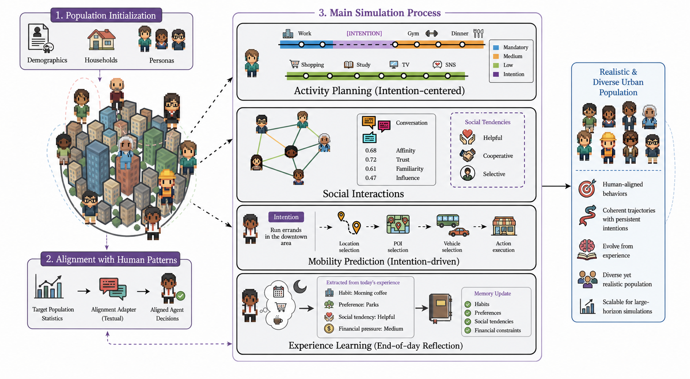

# CityReal: Human-Aligned Urban Behavior and City Dynamics Simulation with Large-Scale LLM Agents

CityReal is an LLM-based urban simulation framework that models city residents as intention-driven agents producing realistic, population-aligned daily behavior (planning/mobility/transport/social/at-home activities) grounded in agent context (persona + memory + beliefs + needs + financial pressure) and calibrated to observed population statistics through learned textual adapters.

It is designed to support large-scale, human-aligned scenario analysis—crowd density, place popularity, mobility flows, well-being, and counterfactual what-if testing—without relying on prompt-only agents that drift toward generic LLM priors.

<p align="center">

  <br>
  <em>Figure 1: The CityReal Framework Architecture.</em>
</p>

## Key ideas
- **Persistent intentions:** rather than re-deciding each step independently, an agent forms a compact intention (goal, optional area anchor, expected duration, completion status) when a flexible block begins, providing shared context so consecutive decisions stay coherent; an orchestrator decides whether to continue, revise, complete, or replace it.
- **Experience-driven reflection:** at the end of each day, the agent extracts what it actually learned—habits, preferences, constraints, social tendencies—as structured reflections (condition, tendency, evidence, implication), integrated gradually into reflective memory so patterns reflect recurring evidence rather than isolated events.
- **Population-level behavioral alignment:** an analyst LLM diagnoses the gap between simulated and target population statistics and proposes typed edits over a fixed style-axis vocabulary; a rewriter LLM turns each edit into a short soft-tendency adapter (no clock times, distances, or absolutisms), searched with Monte Carlo Tree Search while the underlying LLM stays frozen.
- **Explicit financial state:** a continuous financial-pressure signal, derived from income, spending, and remaining budget, conditions activity choice, destination choice, transport selection, and stay-home decisions, capturing socioeconomic heterogeneity.
- **Coherent + calibrated behavior:** together with persona, memory, belief, needs, and social modules, these mechanisms yield agents that adapt to context at the individual level while remaining aligned with observed human behavior at the population level.

## Code Structure
```
src/
├── planning_mandatory.py          # Daily skeleton: mandatory activities (sleep/work/commute/obligations)
├── planning_medium.py             # Recursive fill of EMPTY blocks with medium-priority essentials
├── intention.py                   # Intention formation for flexible blocks (goal/area/duration/status)
├── orchestrator.py                # Continue / revise / complete / replace the active intention; route to a block
├── home_activity.py               # At-home activity selection (rest / chore / hobby / family / other)
├── mobility_area_selection.py     # Stage-1: choose a broad area for the intention
├── mobility_place_selection.py    # Stage-2: choose the POI type
├── mobility_place_type.py         # Refine the POI type to a subtype
├── mobility_place_analysis.py     # POI filters/constraints feeding the belief-aware gravity model
├── mobility_radius.py             # Maximum travel radius for the next trip
├── vehicle_selection.py           # Transport mode over {walking, bicycle, car, bus, train}
├── duration.py                    # Activity duration estimation (5-min aligned, excludes travel)
├── belief_observation.py          # Per-visit belief over {affordability, convenience, crowding, enjoyment}
├── belief_estimate.py             # Belief estimation for unvisited POIs from similar known places
├── needs_init.py                  # Initialize hunger/energy/safety/social + decay/thresholds/dominant need
├── needs_eval.py                  # Update needs after an action; recompute dominant need / interruption
├── needs_reflect.py               # Re-estimate needs after an intervention; decide interruption
├── financial_pressure.py          # Continuous financial-pressure signal (formula; not an LLM call)
├── habits.py                      # Weekly habit / routine summarization
├── social_message.py              # Message generation for face-to-face / online interaction
├── social_belief_update.py        # Update social beliefs {affinity, trust, familiarity} after interaction
├── reflection.py                  # End-of-day reflection {condition, tendency, evidence, implication}
├── alignment_analyst.py           # Analyst: diagnose simulated-vs-target gap, propose typed adapter edits
├── alignment_rewriter.py          # Rewriter: instantiate an edit as a short soft-tendency adapter
├── alignment_judge.py             # Judge: approve / reject a proposed adapter
└── style_axes.py                  # Adapter edit vocabulary (style axes + directions) and selector features
```

## Features

✅ Intention-driven, multi-step daily rollouts (plan → flexible blocks → mobility → at-home / social activities → end-of-day reflection)
✅ Persona-, memory-, belief-, and needs-conditioned decisions with rationales
✅ Explicit financial-pressure state conditioning activity, destination, transport, and stay-home choices
✅ Population-level alignment via MCTS-searched textual adapters, with a frozen backbone LLM
✅ Scenario / counterfactual analysis (crowd density, place popularity, mobility flows, well-being)

## Abstract
Large-scale urban simulation plays a pivotal role in social science, traffic safety, and transportation policy. Recent work has shown that large language models, when prompted as agents, can generate lifelike daily routines at city scale. Yet these methods typically rely on few-shot prompting, causing agents to reproduce the LLM's behavioral priors rather than the target population. We introduce CityReal, a modular framework for human-aligned urban simulation. CityReal models agents as intention-driven decision makers that pursue coherent mobility and activity plans rather than isolated step-by-step choices. They adapt over time by learning habits and preferences based on experience and constraints. To improve population-level realism, we learn concise textual adapters for individual modules that guide agent behavior toward observed population statistics. Experiments show that CityReal improves alignment with real-world human behavior at both micro and macro levels. Scaling to tens of thousands of agents, it supports analysis of crowd density, place popularity, mobility flows, and well-being under different urban scenarios, serving as a scalable testbed for urban simulation and forecasting.
